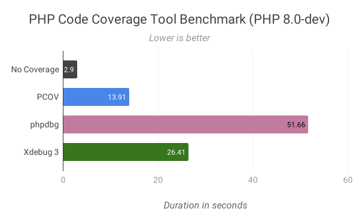
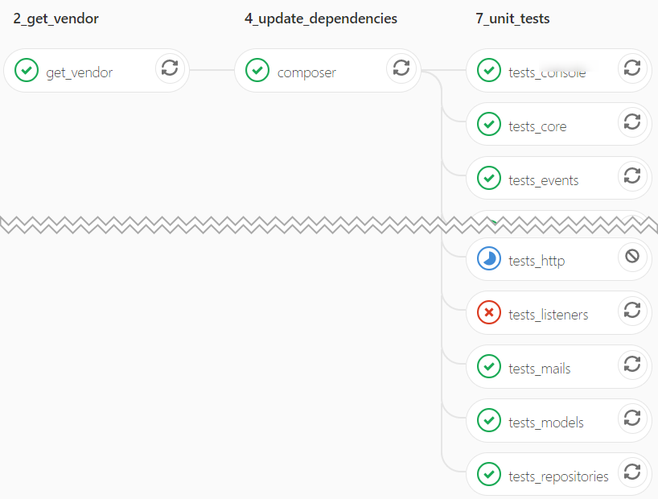
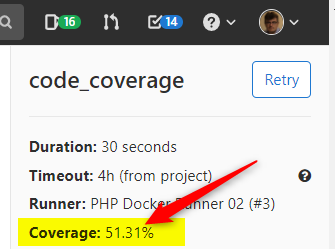

<!-- markdownlint-disable MD033 -->

# PhpUnit - Tips

> Some tips and tricks for phpunit


- [Enable step-by-step debugging in vscode](#enable-step-by-step-debugging-in-vscode)
- [Output a text on the console when phpunit is started with --debug argument](#output-a-text-on-the-console-when-phpunit-is-started-with---debug-argument)
- [Improve performance tips](#improve-performance-tips)
  - [HIGH - Parallel tests with paratest](#high---parallel-tests-with-paratest)
  - [HIGH - Avoid to use XDEBUG for code coverage but use phpcov](#high---avoid-to-use-xdebug-for-code-coverage-but-use-phpcov)
  - [HIGH - Multiple stages in your pipeline](#high---multiple-stages-in-your-pipeline)
  - [MEDIUM - Prefer vendor/bin/phpunit instead of php artisan test (only if not running parallel tests)](#medium---prefer-vendorbinphpunit-instead-of-php-artisan-test-only-if-not-running-parallel-tests)
  - [LOW - BCRYPT](#low---bcrypt)
  - [LOW - Process isolation](#low---process-isolation)
    - [Cannot declare class ... because the name is already in use](#cannot-declare-class--because-the-name-is-already-in-use)
  - [Identify slowest tests](#identify-slowest-tests)
- [GitLab](#gitlab)
  - [Display the JUNIT report directly from GitLab CI result](#display-the-junit-report-directly-from-gitlab-ci-result)
  - [Show code coverage](#show-code-coverage)
- [FAQ](#faq)
  - [The test is running alone but not with another](#the-test-is-running-alone-but-not-with-another)

## Enable step-by-step debugging in vscode

1. Make sure your `phpunit.xml` file didn't have the `processIsolation` set to `true`, if so, change the value to `false` *(there is no way to disable this flag using command line arguments)*,
2. Add a breakpoint in one of your test scenario and press <kbd>F5</kbd> to start the debugger in vscode,
3. On the command line, run `vendor/bin/phpunit --stop-on-failure --no-coverage --configuration .config/phpunit.xml tests/Unit/app/Core`,
4. vscode will stop on the breakpoint and you'll be able to use the debugger.

`--stop-on-failure` is not strictly required but recommended during local development to not wait until all the tests suite is finished.

Under Laravel 8+, you can also use `php artisan test --stop-on-failure  --no-coverage --configuration .config/phpunit.xml tests/Unit/app/Core` for a better user experience.

## Output a text on the console when phpunit is started with --debug argument

> [https://stackoverflow.com/a/12612733/1065340](https://stackoverflow.com/a/12612733/1065340)

It seems there is no PHPUnit internal API to detect this but this workaround can be used:

```php
if (in_array('--debug', $_SERVER['argv'], true)) fwrite(STDOUT, __METHOD__ . ' - Use '. $fileName);
```

So, in your Test parent class (or just create a `Trait`), just add the following function:

```php
/**
 * Write a message to the console when phpunit is started with the `--debug` CLI argument
 *
 * @param string $message The message to write on the console
 *
 * @return void
 */
protected function debug(string $message): void {
    if (in_array('--debug', $_SERVER['argv'], true)) {
        $functionName=debug_backtrace()[1]['class'].'::'.debug_backtrace()[1]['function'];
        fwrite(STDOUT, '[DEBUG] '. $functionName . ' - ' .$message . "\n");
    }
}
```

And, from now, to use it write something like `$this->debug('Using input file: '. $path);`)

## Improve performance tips

A `HIGH` tip will greatly improve performance while a `LOW` tip will have less significant impact.

### HIGH - Parallel tests with paratest

> [https://github.com/paratestphp/paratest](https://github.com/paratestphp/paratest)

If you're using Laravel 8 or greater, you can run tests using the `--parallel` argument:

```bash
php artisan test --parallel --no-coverage --configuration .config/phpunit.xml 
```

Be careful: `--parallel` should be the first argument; not recognized otherwise.

It will works out-of-the-box i.e. you don't need to do something to make it works.

Note: if you're using `phpunit.xml` to restrict the execution to some groups (`include` or `exclude`), **you'll need to specify them on the command line**, it seems paratest can't do this by itself.

```xml
<?xml version="1.0" encoding="UTF-8"?>
<phpunit ...>
    <groups>
        <include>
            <group>MyGroup1</group>
            <group>MyGroup2</group>
            <group>MyGroup3</group>
            <group>MyGroup4</group>
        </include>
    </groups>
</phpunit>
```

```bash
# Include groups 
php artisan test --parallel --no-coverage --configuration .config/phpunit.xml --group="MyGroup1,MyGroup2,MyGroup3,MyGroup4"
```

```bash
# Exclude groups
php artisan test --parallel --no-coverage --configuration .config/phpunit.xml --exclude-group="MyGroup1,MyGroup2,MyGroup3,MyGroup4"
```

Tip: instead of using groups (include/exclude), prefer to create `test-suite` as illustrated below, in this document.

Below a summary of some tests with and without parallel tests (using Laravel here). As you can see, the gain is huge: ==**Almost four times faster!**==

| test-suite   | # tests | php artisan test | php artisan test --parallel |
| ------------ | ------: | ---------------: | --------------------------: |
| console      |      13 |        94.41 sec |                   63.61 sec |
| core         |      12 |       102.79 sec |                   52.88 sec |
| events       |       1 |         6.57 sec |                    7.09 sec |
| factories    |       6 |        54.08 sec |                   37.53 sec |
| fdm          |       2 |        12.68 sec |                    7.45 sec |
| http         |     223 |      3581.28 sec |                  785.36 sec |
| models       |       3 |        28.14 sec |                    12.5 sec |
| repositories |      11 |        96.23 sec |                   25.42 sec |
| **total**    | **271** |  **3976.18 sec** |              **991.84 sec** |

### HIGH - Avoid to use XDEBUG for code coverage but use phpcov

> [40 times faster PHP Code Coverage Reporting with PCOV](https://www.kurmis.com/2020/01/15/pcov-for-faster-code-coverage.html)



*source: <https://php.watch/articles/php-code-coverage-comparison>*

Install the pcov PHP extension and stop using XDEBUG (`XDEBUG_MODE=off`) will increase performance significantly.

```dockerfile
RUN set -e -x \
    echo "Install pcov"; \
    pecl install pcov && docker-php-ext-enable pcov; \
    apt-get clean; rm -rf /tmp/pear/* /tmp/* /var/list/apt/*
```

Then, just run phpunit and display the generated code coverage report:

```bash
XDEBUG_MODE=off vendor/bin/phpunit configuration=.config/phpunit.xml --coverage-text=.output/code-coverage.txt
head -n 10 .output/code-coverage.txt
```

Your `phpunit.xml` file can be defined like below to define where to put the code coverage cache information. Nothing more is needed.

```xml
<?xml version="1.0" encoding="UTF-8"?>
<phpunit  ...>
    ...
    <coverage cacheDirectory=".output/code-coverage-cache" processUncoveredFiles="true">
        <include>
            <directory suffix=".php">./../app</directory>
        </include>
    </coverage>
    ...
</phpunit>
```

During my tests, ==the gain was about 50% i.e. two times faster with exactly the same feature (no loss).==

### HIGH - Multiple stages in your pipeline

Even if you've a single `phpunit.xml` file for all your tests; you can create different suites. In the example below, we've all our test classes in our folder `tests/Unit/app/`.

We've created different sub-folders by themes like testing the console, testing core features, testing events, ...

```xml
<?xml version="1.0" encoding="UTF-8"?>
<phpunit ... >
    <testsuites>
        <testsuite name="console">
            <directory suffix="Test.php">tests/Unit/app/Console</directory>
        </testsuite>
        <testsuite name="core">
            <directory suffix="Test.php">tests/Unit/app/Core</directory>
        </testsuite>
        <testsuite name="events">
            <directory suffix="Test.php">tests/Unit/app/Events</directory>
        </testsuite>
        ...
    </testsuites>
</phpunit>
```

To run a given suite, we'll use the `--testsuite` argument:

```bash
php artisan test --parallel --configuration=.config/phpunit.xml --testsuite console
```

So, now, the idea is to have a CI file (like `.gitlab-ci.yml`) and as many stages that we've test suites:



### MEDIUM - Prefer vendor/bin/phpunit instead of php artisan test (only if not running parallel tests)

If you're coding with Laravel and don't want parallel tests, prefer `vendor/bin/phpunit` (faster) and not `php artisan test` (slower).

Below the same test suite, first started with `vendor/bin/phpunit`; it takes 97 seconds to complete. The same with `php artisan test` takes 105 seconds.

```bash
>vendor/bin/phpunit --no-coverage --configuration .config/phpunit.xml --testsuite core

PHPUnit 9.5.25

............                                            12 / 12 (100%)

Time: 01:37.450, Memory: 52.50 MB

OK (12 tests, 176 assertions)
```

```bash
>php artisan test --no-coverage --configuration .config/phpunit.xml --testsuite core

   PASS  Tests\Unit\Core\Conditions\EvaluatedHasBeenEvaluatorDuringCycleTest
  ✓ test condition

   PASS  Tests\Unit\Core\Conditions\ContentConditionsTest
  ✓ check with data set "#1"
  ✓ check with data set "#2"
  ✓ check with data set "#3"

   PASS  Tests\Unit\Core\Conditions\ContentMailConditionsTest
  ✓ check with data set "#1"
  ✓ check with data set "#2"
  ✓ check with data set "#3"

   PASS  Tests\Unit\Core\Roles\ManagerTest
  ✓ get available role ids
  ✓ get available role ids with data set #1
  ✓ get available role ids with data set #2
  ✓ get available role ids with data set #3

   PASS  Tests\Unit\Core\RouteTest
  ✓ check end points

  Tests:  12 passed
  Time:   105.22s
```

Important: but, as mentioned earlier, running parallel tests are a major performance optimization so, this tip is valid only if you don't wan't / can't use parallel tests (older version of Laravel f.i.).

### LOW - BCRYPT

During tests, we can set `BCRYPT` to just 1 i.e. we don't need very secure passwords (encrypted more than once); it's just for tests purposes so set `BCRYPT` to the smallest number: `1`.

```xml
<?xml version="1.0" encoding="UTF-8"?>
<phpunit ... processIsolation="false" ...>
    ...
    <php>
        <env name="BCRYPT_ROUNDS" value="1" />
    </php>
</phpunit>
```

### LOW - Process isolation

Running phpunit with process isolation means that every tests will be fired in a "refreshed" environment and this is time consuming.

The ideal world is to be able to set `processIsolation="false"` in your `phpunit.xml` file like this:

```xml
<?xml version="1.0" encoding="UTF-8"?>
<phpunit ... processIsolation="false" ...>
    ...
</phpunit>
```

Important: ==**Be careful with `process_isolation=false` since this can conduct to unpredictable behaviour.**==

The solution is to edit that class and add these two doc-block notations for the class itself:

```php
/**
 * @runInSeparateProcess
 * @preserveGlobalState disabled
 */
class MyTestTest extends PHPUnit\Framework\TestCase
```

We can also run that particular in the CLI using the `--process-isolation` argument.

Below a summary of some tests. We can see that, in general, set `process_isolation=false` gives better results (last column) but not always. We can see that, for our `http` suite, it's worst. Perhaps because, in that suite, I was forced to use the `@runInSeparateProcess` annotation more than once and thus, there was a mix of configuration items and this is not optimized...  Some suites like `core` don't have mix and we can see the result is better.  ==**But, globally, the difference isn't really significant.**==

| suite        | # tests |  isolation=true | isolation=false |
| ------------ | ------: | --------------: | --------------: |
| console      |      13 |       94.41 sec |       95.24 sec |
| core         |      12 |      102.79 sec |       93.84 sec |
| events       |       1 |        6.57 sec |        6.48 sec |
| factories    |       6 |       54.08 sec |       56.83 sec |
| fdm          |       2 |       12.68 sec |       14.22 sec |
| http         |     223 |     3581.28 sec |     3680.57 sec |
| models       |       3 |       28.14 sec |       24.91 sec |
| repositories |      11 |       96.23 sec |        97.5 sec |
| **total**    | **271** | **3976.18 sec** | **4069.59 sec** |

#### Cannot declare class ... because the name is already in use

When your tests is using a mock-up like, for Laravel, `Mockery::mock`, you'll get a *Cannot declare class* error **as soon as** you'll ask code coverage. This because the code coverage will load every classes of your project and will detect if the class is covered or not.

When a class has been already *mocked-up*, an instance already exists in memory and thus, we'll get the error.

```text
PHP Fatal error:  Cannot declare class ..., because the name is already in use in ... on line ...
```

### Identify slowest tests

The [PHPUNit report](https://marmelab.com/phpunit-d3-report/) online visualization tool will allow to identify which tests are the slowest ones.

First, you'll need to generate a report using the `--log-junit report.xml` argument (f.i. `phpunit --configuration .config/phpunit.xml --log-junit report.xml`). Then upload the `report.xml` file on [PHPUNit report](https://marmelab.com/phpunit-d3-report/) and click on the `Generate` button.

The image below illustrate the case where we've one fail test (in red), three risky tests (in yellow) and the successful ones (in green). How bigger the circle is, how much time it takes.


## GitLab

### Display the JUNIT report directly from GitLab CI result

> [https://docs.gitlab.com/ee/ci/testing/unit_test_reports.html](https://docs.gitlab.com/ee/ci/testing/unit_test_reports.html)

GitLab can display **Unit test reports** directly by reusing the **JUnit** report generated by phpunit.

Just add `--log-junit=.output/junit_report.xml` to the phpunit command line: `vendor/bin/phpunit --configuration .config/phpunit.xml --log-junit=.output/junit_report.xml`

Then, in the `.gitlab-ci.yml` file, you'll need to use the dedicated `junit` node of `artifacts->reports` like below:

```yml
phpunit_test:
  [ ... ]
  artifacts:
    paths:
      - .output/*
    reports:
      junit: .output/junit_report.xml
    expire_in: 1 week
    when: on_failure
```

### Show code coverage

If you've code coverage enabled, your Gitlab CI html output will probably display something like:

```text
Code Coverage Report:         
   2022-10-21 16:05:33         
                               
  Summary:                     
   Classes: 30.26% (200/661)   
   Methods: 42.28% (989/2339)  
   Lines:   51.31% (7113/13862)
```

The code coverage percentage is displayed on the line starting with `Lines:`.

In order to display it like below (in the top right corner of the job output); you'll need to go to the `CI / CD Settings` page of the repository, then expand `General pipelines` and scroll down to the `Test coverage parsing` area. There you'll need to specify a regular expression that will match the `Lines:` line. A working regex can be: **`/^\s*Lines:\s*\d+.\d+\%/`**.



## FAQ

### The test is running alone but not with another

Running the test alone (f.i. using the `--filter` option) is successful but the same test fails when fired with another.

The error message can vary, here is one (for a Laravel application): *PHP Fatal error:  Uncaught ReflectionException: Class "config" does not exist*

The problem is probably linked to the isolation of processes. Try to add the two annotations below in the PHP docblock of the class:

```php
/**
 * @preserveGlobalState disabled
 * @runTestsInSeparateProcesses
 */
class myClass extends TestCase {
    /* ... */
}
```
